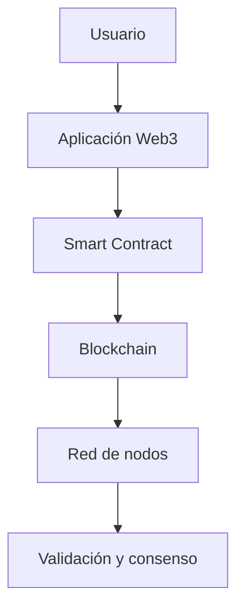

# 01. Introducción y Conceptos Fundamentales de Blockchain y Web3

## 🌟 Historia y Evolución de Blockchain

La tecnología blockchain surge en 2008 con la publicación del whitepaper de Bitcoin por Satoshi Nakamoto. Su objetivo inicial fue crear una moneda digital descentralizada, pero la arquitectura blockchain ha evolucionado para soportar aplicaciones mucho más allá de las criptomonedas.

### Cronología clave:
- **2008**: Whitepaper de Bitcoin
- **2009**: Lanzamiento de la red Bitcoin
- **2015**: Ethereum introduce contratos inteligentes
- **2017**: Explosión de ICOs y tokens ERC20
- **2020**: DeFi y NFTs ganan protagonismo
- **2021+**: Web3, DAOs, interoperabilidad y escalabilidad

## 🛠️ Arquitectura y Funcionamiento



### Componentes principales:
- **Blockchain**: Registro distribuido, inmutable y transparente
- **Smart Contracts**: Programas autoejecutables en la blockchain
- **Tokens**: Representación digital de valor o activos
- **Wallets**: Identidad y gestión de claves

## 🔤 Sintaxis Básica de un Smart Contract (Solidity)

```solidity
// HolaBlockchain.sol
// SPDX-License-Identifier: MIT
pragma solidity ^0.8.0;

contract HolaBlockchain {
	string public mensaje = "¡Hola, Blockchain!";

	function actualizarMensaje(string memory nuevoMensaje) public {
		mensaje = nuevoMensaje;
	}
}
```

## 📊 Casos de Uso y Aplicaciones

- Criptomonedas (Bitcoin, Ethereum)
- Finanzas descentralizadas (DeFi)
- NFTs y activos digitales
- Identidad digital y DAOs
- Trazabilidad y logística

## ⚙️ Ejercicio Práctico

1. Investiga un caso de uso real de blockchain (por ejemplo, trazabilidad alimentaria, DeFi, NFTs).
2. Escribe un resumen de cómo blockchain aporta valor en ese caso.
3. (Opcional) Instala MetaMask y explora una dApp en la red Ethereum.

## 🎯 Buenas Prácticas y Seguridad

- Protege tus claves privadas y seed phrase
- Verifica contratos antes de interactuar
- Usa redes de prueba (testnet) para experimentar
- Mantente informado sobre vulnerabilidades y actualizaciones

---

**Siguiente**: [02. Conceptos Fundamentales de Blockchain](./02-conceptos.md) | **Inicio**: [README](../README.md)