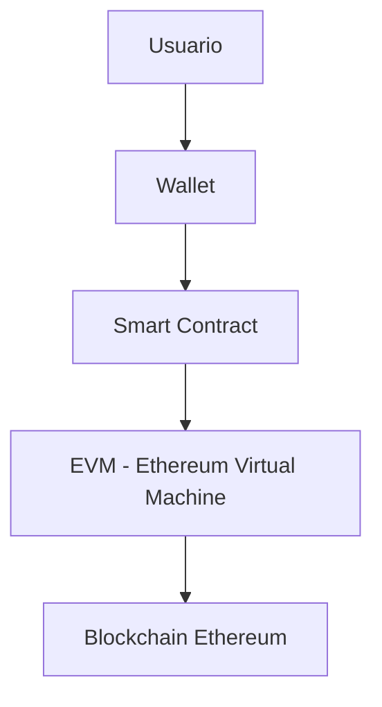

# 02. Ethereum y Contratos Inteligentes

## 🌟 Historia y Evolución de Ethereum

Ethereum fue propuesto en 2013 por Vitalik Buterin y lanzado en 2015. Su principal innovación fue permitir la ejecución de contratos inteligentes, programas que se ejecutan en la blockchain de forma descentralizada.

### Cronología clave:
- **2013**: Propuesta de Ethereum
- **2015**: Lanzamiento de la red Ethereum
- **2016**: The DAO y el hard fork
- **2017**: ERC20 y auge de ICOs
- **2021+**: Ethereum 2.0 y transición a Proof of Stake

## 🛠️ Arquitectura de Ethereum



### Componentes principales:
- **EVM**: Máquina virtual que ejecuta los contratos
- **Smart Contracts**: Programas autoejecutables
- **Ether (ETH)**: Criptomoneda nativa
- **Gas**: Unidad de coste computacional

## 🔤 Ejemplo de Contrato Inteligente (Solidity)

```solidity
// SimpleStorage.sol
// SPDX-License-Identifier: MIT
pragma solidity ^0.8.0;

contract SimpleStorage {
	uint256 private valor;

	function guardar(uint256 nuevoValor) public {
		valor = nuevoValor;
	}

	function obtener() public view returns (uint256) {
		return valor;
	}
}
```

## 📊 Casos de Uso

- Finanzas descentralizadas (DeFi)
- NFTs y activos digitales
- DAOs y gobernanza
- Juegos y metaverso

## ⚙️ Ejercicio Práctico

1. Despliega el contrato `SimpleStorage` en Remix IDE.
2. Interactúa con las funciones `guardar` y `obtener`.
3. Investiga un proyecto DeFi o NFT basado en Ethereum y resume su funcionamiento.

## 🎯 Buenas Prácticas

- Usa redes de prueba (Ropsten, Goerli) antes de mainnet
- Verifica contratos en Etherscan
- Mantén tus claves privadas seguras
- Revisa el consumo de gas antes de desplegar

---

**Anterior**: [01. Introducción](./01-introduccion.md) | **Siguiente**: [03. Fundamentos de Solidity](./03-fundamentos-solidity.md)
