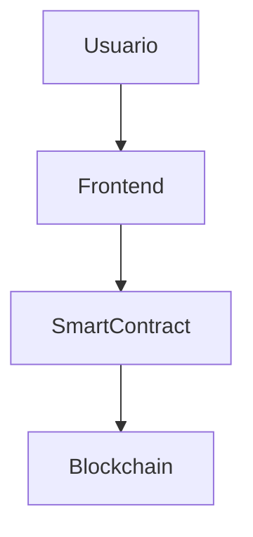

# 11. Descentralización y DApps

## 🌐 ¿Qué es una DApp?

Una DApp (Aplicación Descentralizada) es una aplicación que opera sobre una blockchain, sin un servidor central, y utiliza contratos inteligentes para su lógica principal.

### Características clave

- Código abierto
- Descentralización de datos y lógica
- Incentivos y tokens

## ⚡ Ejemplo: Arquitectura de una DApp

## 📝 Ejercicio Práctico

1. Diseña la arquitectura de una DApp para votar en elecciones.
2. Implementa el frontend usando React y conecta con un contrato en testnet.

## 🎯 Buenas Prácticas

- Usa librerías seguras para interactuar con contratos
- Mantén la lógica crítica en el smart contract
- Audita el código antes de lanzar la DApp

---

**Anterior**: [10. Tokens y Estándares](./10-tokens-estandares.md) | **Siguiente**: [12. Gas y Optimización](./12-gas-optimizacion.md)
