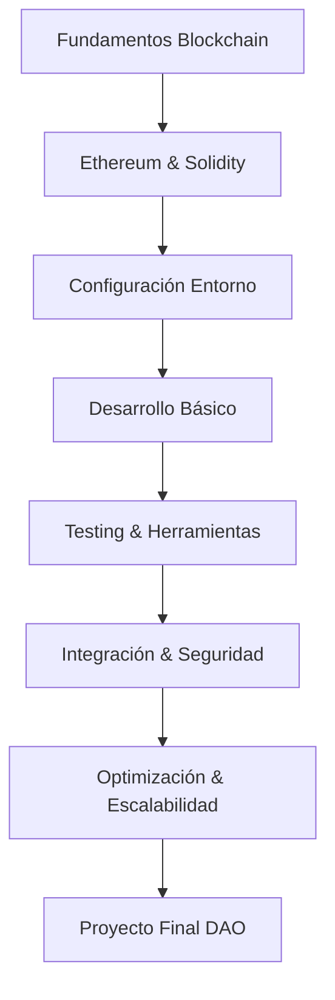

# Curso Completo de Desarrollo en Blockchain con Ethereum y Solidity

Este curso modular te llevará desde los fundamentos hasta el desarrollo avanzado de dApps y contratos inteligentes seguros en Ethereum. Incluye prácticas, mini proyectos y recursos para cada etapa.

## 📚 Estructura del Curso

### 🌟 Fundamentos de Blockchain
1. [01. Introducción y Conceptos Fundamentales](./01-introduccion.md)
2. [02. Conceptos Fundamentales de Blockchain](./02-conceptos.md)
3. [03. Ethereum y Contratos Inteligentes](./03-ethereum-smart-contracts.md)
4. [04. Fundamentos de Solidity](./04-fundamentos-solidity.md)

### ⚙️ Configuración y Entorno
5. [05. Setup y Configuración del Entorno](./05-setup.md)

### 🔨 Desarrollo en Solidity
6. [06. Variables, Tipos y Operadores](./06-variables-tipos-operadores.md)
7. [07. Funciones y Estructuras de Control](./07-funciones-estructuras-control.md)
8. [08. Práctica Guiada - Primer dApp](./08-practica.md)

### 🛠️ Herramientas y Testing
9. [09. Herramientas de Desarrollo](./09-herramientas-desarrollo.md)
10. [10. Desarrollo y Pruebas de Smart Contracts](./10-desarrollo-pruebas-smart-contracts.md)
11. [11. Seguridad Básica en Smart Contracts](./11-seguridad-basica-smart-contracts.md)

### 🔗 Integración y Interacción
12. [12. Integración y Seguridad Avanzada](./12-integracion.md)
13. [13. Interacción con Blockchain](./13-interaccion-blockchain.md)
14. [14. Tokens y Estándares ERC](./14-tokens-estandares.md)
15. [15. Descentralización y dApps](./15-descentralizacion-dapps.md)

### 🚀 Optimización y Escalabilidad
16. [16. Gas y Optimización](./16-gas-optimizacion.md)
17. [17. Seguridad Avanzada](./17-seguridad-avanzada-smart-contracts.md)
18. [18. Documentación y Escalabilidad](./18-documentacion.md)

### 🏗️ Arquitectura y Proyectos
19. [19. Patrones de Arquitectura](./19-patrones-arquitectura-proyectos.md)
20. [20. Evaluación Final y Proyecto DAO](./20-evaluacion.md)
21. [21. Tendencias y Futuro de Web3](./21-tendencias-futuro-web3.md)

## 🎯 Objetivos del Curso

- **Comprender** los fundamentos de blockchain y tecnologías descentralizadas
- **Dominar** el lenguaje Solidity para desarrollo de contratos inteligentes
- **Desarrollar** dApps completas con interfaces web funcionales
- **Implementar** mejores prácticas de seguridad en contratos inteligentes
- **Aplicar** patrones de diseño y arquitecturas escalables
- **Crear** un proyecto final tipo DAO completamente funcional

## 👥 Dirigido a

✅ **Desarrolladores** con conocimientos básicos de programación  
✅ **Estudiantes** de informática o carreras afines  
✅ **Profesionales IT** interesados en blockchain y Web3  
✅ **Emprendedores** que buscan entender la tecnología blockchain  
✅ **Cualquier persona** motivada a aprender desarrollo descentralizado

## 📋 Prerequisitos

- **Conocimientos básicos** de programación (JavaScript, Python, o similar)
- **Familiaridad** con desarrollo web (HTML, CSS, JavaScript)
- **Experiencia** con línea de comandos y Git (recomendado)
- **Instalación** de Node.js y npm en tu sistema

## 🛠️ Tecnologías y Herramientas

### Lenguajes y Frameworks
- **Solidity**: Lenguaje principal para contratos inteligentes
- **JavaScript/TypeScript**: Para desarrollo frontend e interacción
- **HTML/CSS**: Para interfaces de usuario

### Herramientas de Desarrollo
- **Hardhat**: Framework de desarrollo Ethereum
- **MetaMask**: Wallet para interactuar con dApps
- **OpenZeppelin**: Biblioteca de contratos seguros
- **Ethers.js**: Biblioteca para interacción con Ethereum

### Plataformas y Servicios
- **Ethereum**: Blockchain principal
- **IPFS**: Almacenamiento descentralizado
- **Chainlink**: Oráculos para datos externos
- **The Graph**: Indexación de datos blockchain

## 📈 Progresión del Aprendizaje

### Milestone 1: Fundamentos (Módulos 1-4)
- ✅ Comprensión de blockchain y criptomonedas
- ✅ Conocimiento de Ethereum y contratos inteligentes
- ✅ Sintaxis básica de Solidity

### Milestone 2: Desarrollo (Módulos 5-8)
- ✅ Entorno de desarrollo configurado
- ✅ Primer contrato inteligente funcional
- ✅ dApp básica con interfaz web

### Milestone 3: Intermedio (Módulos 9-15)
- ✅ Testing automatizado de contratos
- ✅ Integración con servicios externos
- ✅ Manejo de tokens y estándares

### Milestone 4: Avanzado (Módulos 16-21)
- ✅ Optimización de gas y seguridad avanzada
- ✅ Arquitecturas escalables
- ✅ Proyecto DAO completo

## ⏱️ Duración Estimada

- **Total**: 60-80 horas
- **Por módulo**: 3-4 horas promedio
- **Modalidad**: Autoestudio con ejercicios prácticos
- **Ritmo recomendado**: 2-3 módulos por semana

## 🏆 Certificación

Al completar exitosamente el curso recibirás:
- Certificado de completación
- Badge digital verificable en blockchain
- Proyecto portfolio para GitHub
- Acceso a comunidad de alumni

## 🔗 Recursos Adicionales

### Documentación Oficial
- [Solidity Documentation](https://docs.soliditylang.org/)
- [Ethereum Developer Documentation](https://ethereum.org/developers/)
- [Hardhat Documentation](https://hardhat.org/docs)
- [OpenZeppelin Documentation](https://docs.openzeppelin.com/)

### Herramientas Online
- [Remix IDE](https://remix.ethereum.org/)
- [Etherscan](https://etherscan.io/)
- [OpenZeppelin Wizard](https://wizard.openzeppelin.com/)

### Comunidades
- [Ethereum Stack Exchange](https://ethereum.stackexchange.com/)
- [Discord de Ethereum](https://discord.gg/ethereum)
- [Reddit r/ethereum](https://reddit.com/r/ethereum)

## 📄 Licencia

Este curso está disponible bajo licencia MIT. Ver [LICENSE.md](./LICENSE.md) para más detalles.

---

## 🚀 ¡Comienza tu Journey en Blockchain!

¿Listo para convertirte en un desarrollador blockchain? 

**👉 [Empezar con Módulo 1: Introducción](./01-introduccion.md)**

---

*"El futuro de las aplicaciones es descentralizado. Aprende a construirlo hoy."*
