# 01. Introducción y Conceptos Fundamentales

## 🌟 Introducción a C# y .NET

### Historia y evolución del ecosistema .NET
**C#** (pronunciado "C Sharp") fue desarrollado por Microsoft como parte de la iniciativa .NET Framework, lanzado por primera vez en 2000. Diseñado por Anders Hejlsberg (creador de Turbo Pascal y Delphi), C# combina la potencia de C++ con la simplicidad de Visual Basic.

#### Evolución cronológica:
- **2000**: .NET Framework 1.0 + C# 1.0
- **2005**: C# 2.0 (Generics, nullable types)
- **2007**: C# 3.0 (LINQ, var keyword, lambda expressions)
- **2010**: C# 4.0 (dynamic typing, optional parameters)
- **2012**: C# 5.0 (async/await)
- **2015**: C# 6.0 (string interpolation, null-conditional operators)
- **2017**: C# 7.0 (pattern matching, tuples)
- **2019**: C# 8.0 (nullable reference types, switch expressions)
- **2020**: C# 9.0 (records, init-only properties)
- **2021**: C# 10.0 (global using, file-scoped namespaces)
- **2022**: C# 11.0 (raw string literals, list patterns)
- **2023**: C# 12.0 (primary constructors, collection expressions)

### Arquitectura de .NET

```mermaid
graph TD
    A[Tu Aplicación C#] --> B[.NET Runtime]
    B --> C[Base Class Library]
    B --> D[Common Language Runtime - CLR]
    D --> E[Just-In-Time Compiler]
    D --> F[Garbage Collector]
    D --> G[Exception Handling]
    C --> H[Bibliotecas Específicas]
    H --> I[ASP.NET Core]
    H --> J[Entity Framework]
    H --> K[ML.NET]
```


## 🛠️ Configuración del Entorno de Desarrollo

### Instalación de .NET 8 SDK

#### Windows
```powershell
# Opción 1: Usando winget
winget install Microsoft.DotNet.SDK.8

# Opción 2: Usando Chocolatey
choco install dotnet-8.0-sdk

# Opción 3: Download manual desde https://dotnet.microsoft.com/download
```

#### macOS
```bash
# Usando Homebrew
brew install --cask dotnet-sdk

# Verificar instalación
dotnet --version
```

#### Linux (Ubuntu/Debian)
```bash
# Agregar repositorio Microsoft
wget https://packages.microsoft.com/config/ubuntu/22.04/packages-microsoft-prod.deb -O packages-microsoft-prod.deb
sudo dpkg -i packages-microsoft-prod.deb

# Instalar SDK
sudo apt-get update && sudo apt-get install -y dotnet-sdk-8.0
```

### Configuración de Visual Studio Code
```bash
# Instalar VS Code
winget install Microsoft.VisualStudioCode

# Extensiones esenciales
code --install-extension ms-dotnettools.csharp
code --install-extension ms-dotnettools.csdevkit
code --install-extension ms-dotnettools.vscode-dotnet-runtime
code --install-extension fernandoescolar.vscode-solution-explorer
```

### Tu primer proyecto C#
```bash
# Crear nueva solución
dotnet new sln -n MiPrimerProyecto

# Crear aplicación de consola
dotnet new console -n HolaMundo

# Agregar proyecto a la solución
dotnet sln add HolaMundo/HolaMundo.csproj

# Ejecutar la aplicación
cd HolaMundo
dotnet run
```

## 🔤 Sintaxis Básica de C#

### Estructura básica de un programa
```csharp
// HolaMundo.cs
using System;

namespace HolaMundo
{
    class Program
    {
        static void Main(string[] args)
        {
            Console.WriteLine("¡Hola, Mundo!");
            Console.WriteLine("Bienvenido a C# y .NET");
            
            // Esperar entrada del usuario
            Console.ReadKey();
        }
    }
}
```

### Versión moderna con C# 12 (Top-level programs)
```csharp
// Program.cs (más conciso)
using System;

Console.WriteLine("¡Hola, Mundo!");
Console.WriteLine($"Fecha actual: {DateTime.Now:dd/MM/yyyy}");

// Interacción con el usuario
Console.Write("¿Cómo te llamas? ");
string nombre = Console.ReadLine() ?? "Desconocido";
Console.WriteLine($"¡Hola, {nombre}!");
```

### Comentarios y documentación
```csharp
// Comentario de una línea

/*
 * Comentario de múltiples líneas
 * Útil para explicaciones largas
 */

/// <summary>
/// Calcula el área de un círculo
/// </summary>
/// <param name="radio">Radio del círculo en centímetros</param>
/// <returns>Área del círculo en cm²</returns>
public static double CalcularAreaCirculo(double radio)
{
    return Math.PI * Math.Pow(radio, 2);
}
```

## 📊 Variables y Tipos de Datos

### Tipos de valor (Value Types)
```csharp
// Tipos enteros
byte edad = 25;              // 0 a 255
short poblacion = 30000;     // -32,768 a 32,767
int cantidad = 1500000;      // -2,147,483,648 a 2,147,483,647
long distancia = 9460730472580800L; // Muy grande

// Tipos de punto flotante
float precio = 19.99f;       // Precisión simple
double area = 156.789;       // Precisión doble
decimal dinero = 1500.50m;   // Alta precisión para dinero

// Otros tipos básicos
bool esActivo = true;
char inicial = 'A';
```

### Tipos de referencia (Reference Types)
```csharp
// Strings (inmutables)
string nombre = "Juan Pérez";
string apellido = "González";
string nombreCompleto = $"{nombre} {apellido}";

// Arrays
int[] numeros = { 1, 2, 3, 4, 5 };
string[] frutas = new string[] { "Manzana", "Banana", "Naranja" };

// Ejemplo práctico: almacenar información de estudiantes
string[] estudiantes = new string[3];
estudiantes[0] = "Ana García";
estudiantes[1] = "Carlos López";
estudiantes[2] = "María Rodríguez";
```

### Tipos nullable y var keyword
```csharp
// Tipos nullable (C# 2.0+)
int? edadNullable = null;
double? alturaOpcional = 1.75;

// Verificar valores null
if (edadNullable.HasValue)
{
    Console.WriteLine($"Edad: {edadNullable.Value}");
}

// Var keyword (inferencia de tipos)
var mensaje = "Hola";           // string
var numero = 42;                // int
var lista = new List<string>(); // List<string>
```

### Constantes y readonly
```csharp
// Constantes (compile-time)
const double PI = 3.14159;
const string EMPRESA = "Mi Empresa S.A.";

// Readonly (runtime)
static readonly DateTime FechaInicio = DateTime.Now;

public class Configuracion
{
    public readonly string ServidorBD;
    
    public Configuracion(string servidor)
    {
        ServidorBD = servidor; // Solo se puede asignar en constructor
    }
}
```

## ⚙️ Operadores

### Operadores aritméticos
```csharp
int a = 10, b = 3;

int suma = a + b;        // 13
int resta = a - b;       // 7
int multiplicacion = a * b; // 30
int division = a / b;    // 3 (división entera)
int modulo = a % b;      // 1 (resto)

// Incremento y decremento
int contador = 0;
contador++;              // Post-incremento: contador = 1
++contador;              // Pre-incremento: contador = 2
contador--;              // Post-decremento: contador = 1
--contador;              // Pre-decremento: contador = 0
```

### Operadores de comparación
```csharp
int x = 5, y = 10;

bool esIgual = (x == y);        // false
bool esDiferente = (x != y);    // true
bool esMenor = (x < y);         // true
bool esMayor = (x > y);         // false
bool esMenorIgual = (x <= y);   // true
bool esMayorIgual = (x >= y);   // false
```

### Operadores lógicos
```csharp
bool condicion1 = true;
bool condicion2 = false;

bool resultadoAnd = condicion1 && condicion2;  // false
bool resultadoOr = condicion1 || condicion2;   // true
bool resultadoNot = !condicion1;               // false

// Evaluación de cortocircuito
bool evaluacion = (x > 0) && (100 / x > 5); // Seguro, no divide por cero
```

### Operadores de asignación
```csharp
int numero = 10;

numero += 5;    // numero = numero + 5 (15)
numero -= 3;    // numero = numero - 3 (12)
numero *= 2;    // numero = numero * 2 (24)
numero /= 4;    // numero = numero / 4 (6)
numero %= 5;    // numero = numero % 5 (1)
```

## 🔄 Estructuras de Control

### Condicionales if-else
```csharp
// Ejemplo: Sistema de calificaciones
Console.Write("Ingresa tu calificación (0-100): ");
if (int.TryParse(Console.ReadLine(), out int calificacion))
{
    string letra;
    string mensaje;
    
    if (calificacion >= 90)
    {
        letra = "A";
        mensaje = "Excelente trabajo!";
    }
    else if (calificacion >= 80)
    {
        letra = "B";
        mensaje = "Buen trabajo!";
    }
    else if (calificacion >= 70)
    {
        letra = "C";
        mensaje = "Trabajo satisfactorio";
    }
    else if (calificacion >= 60)
    {
        letra = "D";
        mensaje = "Necesitas mejorar";
    }
    else
    {
        letra = "F";
        mensaje = "Reprobado";
    }
    
    Console.WriteLine($"Calificación: {letra} - {mensaje}");
}
else
{
    Console.WriteLine("Por favor ingresa un número válido.");
}
```

### Switch expressions (C# 8.0+)
```csharp
// Versión moderna con switch expression
string ObtenerCalificacion(int puntos) => puntos switch
{
    >= 90 => "A - Excelente",
    >= 80 => "B - Muy bueno",
    >= 70 => "C - Bueno",
    >= 60 => "D - Regular",
    _ => "F - Reprobado"
};

// Ejemplo de uso
Console.Write("Puntos obtenidos: ");
if (int.TryParse(Console.ReadLine(), out int puntos))
{
    string resultado = ObtenerCalificacion(puntos);
    Console.WriteLine(resultado);
}
```

### Bucles for
```csharp
// Bucle for básico
Console.WriteLine("Números del 1 al 10:");
for (int i = 1; i <= 10; i++)
{
    Console.Write($"{i} ");
}
Console.WriteLine();

// Bucle for con step diferente
Console.WriteLine("Números pares del 2 al 20:");
for (int i = 2; i <= 20; i += 2)
{
    Console.Write($"{i} ");
}
Console.WriteLine();

// Bucle for anidado (tabla de multiplicar)
Console.WriteLine("\nTabla de multiplicar:");
for (int i = 1; i <= 5; i++)
{
    for (int j = 1; j <= 5; j++)
    {
        Console.Write($"{i * j:D2} ");
    }
    Console.WriteLine();
}
```

### Bucles while y do-while
```csharp
// While loop - menú interactivo
int opcion;
do
{
    Console.WriteLine("\n=== MENÚ PRINCIPAL ===");
    Console.WriteLine("1. Saludar");
    Console.WriteLine("2. Calcular área de círculo");
    Console.WriteLine("3. Mostrar fecha actual");
    Console.WriteLine("0. Salir");
    Console.Write("Selecciona una opción: ");
    
} while (!int.TryParse(Console.ReadLine(), out opcion) || opcion < 0 || opcion > 3);

switch (opcion)
{
    case 1:
        Console.WriteLine("¡Hola! Bienvenido al programa");
        break;
    case 2:
        Console.Write("Ingresa el radio: ");
        if (double.TryParse(Console.ReadLine(), out double radio))
        {
            double area = Math.PI * Math.Pow(radio, 2);
            Console.WriteLine($"Área del círculo: {area:F2} cm²");
        }
        break;
    case 3:
        Console.WriteLine($"Fecha actual: {DateTime.Now:dddd, dd MMMM yyyy HH:mm:ss}");
        break;
    case 0:
        Console.WriteLine("¡Hasta luego!");
        break;
}
```

### Foreach con colecciones
```csharp
// Array de ciudades
string[] ciudades = { "Madrid", "Barcelona", "Valencia", "Sevilla", "Bilbao" };

Console.WriteLine("Ciudades de España:");
foreach (string ciudad in ciudades)
{
    Console.WriteLine($"- {ciudad}");
}

// Lista de números con operaciones
List<int> numeros = new List<int> { 1, 2, 3, 4, 5, 6, 7, 8, 9, 10 };

Console.WriteLine("\nNúmeros pares:");
foreach (int numero in numeros.Where(n => n % 2 == 0))
{
    Console.WriteLine($"Número par: {numero}");
}
```

## 🎯 Ejercicios Prácticos

### Ejercicio 1: Calculadora básica
```csharp
using System;

class CalculadoraBasica
{
    static void Main()
    {
        Console.WriteLine("=== CALCULADORA BÁSICA ===");
        
        // Obtener primer número
        Console.Write("Ingresa el primer número: ");
        double num1 = Convert.ToDouble(Console.ReadLine());
        
        // Obtener operador
        Console.Write("Ingresa el operador (+, -, *, /): ");
        char operador = Console.ReadKey().KeyChar;
        Console.WriteLine();
        
        // Obtener segundo número
        Console.Write("Ingresa el segundo número: ");
        double num2 = Convert.ToDouble(Console.ReadLine());
        
        // Realizar cálculo
        double resultado = operador switch
        {
            '+' => num1 + num2,
            '-' => num1 - num2,
            '*' => num1 * num2,
            '/' when num2 != 0 => num1 / num2,
            '/' => throw new DivideByZeroException("No se puede dividir por cero"),
            _ => throw new ArgumentException("Operador no válido")
        };
        
        Console.WriteLine($"\nResultado: {num1} {operador} {num2} = {resultado:F2}");
    }
}
```

### Ejercicio 2: Generador de números primos
```csharp
using System;
using System.Collections.Generic;

class GeneradorPrimos
{
    static void Main()
    {
        Console.Write("¿Hasta qué número quieres generar primos? ");
        int limite = int.Parse(Console.ReadLine());
        
        List<int> primos = GenerarPrimos(limite);
        
        Console.WriteLine($"\nNúmeros primos hasta {limite}:");
        foreach (int primo in primos)
        {
            Console.Write($"{primo} ");
        }
        
        Console.WriteLine($"\n\nSe encontraron {primos.Count} números primos.");
    }
    
    static List<int> GenerarPrimos(int limite)
    {
        List<int> primos = new List<int>();
        
        for (int numero = 2; numero <= limite; numero++)
        {
            if (EsPrimo(numero))
            {
                primos.Add(numero);
            }
        }
        
        return primos;
    }
    
    static bool EsPrimo(int numero)
    {
        if (numero < 2) return false;
        if (numero == 2) return true;
        if (numero % 2 == 0) return false;
        
        for (int i = 3; i * i <= numero; i += 2)
        {
            if (numero % i == 0)
                return false;
        }
        
        return true;
    }
}
```

### Ejercicio 3: Sistema de gestión de estudiantes
```csharp
using System;
using System.Collections.Generic;
using System.Linq;

class SistemaEstudiantes
{
    static List<Estudiante> estudiantes = new List<Estudiante>();
    
    static void Main()
    {
        bool continuar = true;
        
        while (continuar)
        {
            MostrarMenu();
            
            if (int.TryParse(Console.ReadLine(), out int opcion))
            {
                switch (opcion)
                {
                    case 1: AgregarEstudiante(); break;
                    case 2: MostrarEstudiantes(); break;
                    case 3: BuscarEstudiante(); break;
                    case 4: MostrarEstadisticas(); break;
                    case 0: continuar = false; break;
                    default: Console.WriteLine("Opción no válida"); break;
                }
            }
        }
    }
    
    static void MostrarMenu()
    {
        Console.WriteLine("\n=== SISTEMA DE ESTUDIANTES ===");
        Console.WriteLine("1. Agregar estudiante");
        Console.WriteLine("2. Mostrar todos los estudiantes");
        Console.WriteLine("3. Buscar estudiante");
        Console.WriteLine("4. Mostrar estadísticas");
        Console.WriteLine("0. Salir");
        Console.Write("Selecciona una opción: ");
    }
    
    static void AgregarEstudiante()
    {
        Console.Write("Nombre: ");
        string nombre = Console.ReadLine();
        
        Console.Write("Edad: ");
        int edad = int.Parse(Console.ReadLine());
        
        Console.Write("Calificación: ");
        double calificacion = double.Parse(Console.ReadLine());
        
        estudiantes.Add(new Estudiante(nombre, edad, calificacion));
        Console.WriteLine("Estudiante agregado exitosamente!");
    }
    
    static void MostrarEstudiantes()
    {
        if (estudiantes.Count == 0)
        {
            Console.WriteLine("No hay estudiantes registrados.");
            return;
        }
        
        Console.WriteLine("\n=== LISTA DE ESTUDIANTES ===");
        foreach (var estudiante in estudiantes.OrderBy(e => e.Nombre))
        {
            Console.WriteLine(estudiante);
        }
    }
    
    static void BuscarEstudiante()
    {
        Console.Write("Ingresa el nombre a buscar: ");
        string nombre = Console.ReadLine();
        
        var encontrado = estudiantes
            .Where(e => e.Nombre.Contains(nombre, StringComparison.OrdinalIgnoreCase))
            .ToList();
        
        if (encontrado.Any())
        {
            Console.WriteLine("Estudiantes encontrados:");
            encontrado.ForEach(e => Console.WriteLine(e));
        }
        else
        {
            Console.WriteLine("No se encontraron estudiantes con ese nombre.");
        }
    }
    
    static void MostrarEstadisticas()
    {
        if (estudiantes.Count == 0)
        {
            Console.WriteLine("No hay estudiantes para mostrar estadísticas.");
            return;
        }
        
        double promedio = estudiantes.Average(e => e.Calificacion);
        double maxima = estudiantes.Max(e => e.Calificacion);
        double minima = estudiantes.Min(e => e.Calificacion);
        int aprobados = estudiantes.Count(e => e.Calificacion >= 60);
        
        Console.WriteLine("\n=== ESTADÍSTICAS ===");
        Console.WriteLine($"Total estudiantes: {estudiantes.Count}");
        Console.WriteLine($"Calificación promedio: {promedio:F2}");
        Console.WriteLine($"Calificación máxima: {maxima:F2}");
        Console.WriteLine($"Calificación mínima: {minima:F2}");
        Console.WriteLine($"Estudiantes aprobados: {aprobados}");
        Console.WriteLine($"Porcentaje de aprobación: {(double)aprobados / estudiantes.Count * 100:F1}%");
    }
}

class Estudiante
{
    public string Nombre { get; }
    public int Edad { get; }
    public double Calificacion { get; }
    
    public Estudiante(string nombre, int edad, double calificacion)
    {
        Nombre = nombre;
        Edad = edad;
        Calificacion = calificacion;
    }
    
    public override string ToString()
    {
        return $"{Nombre} ({Edad} años) - Calificación: {Calificacion:F1}";
    }
}
```

---

**Siguiente**: [02. Programación Orientada a Objetos](./02-poo.md) | **Inicio**: [README](../README.md)
