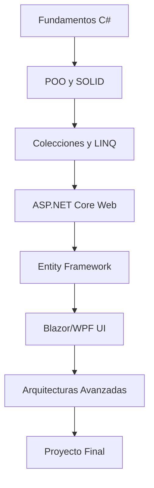

# 🚀 C# y .NET: De Básico a Arquitecto de Software

## 📋 Información General

**Duración**: 12 semanas  
**Modalidad**: Práctica intensiva  
**Nivel**: Básico a Avanzado  
**Tecnologías**: C# 12, .NET 8, ASP.NET Core, Entity Framework, Blazor

> Un curso completo que te llevará desde los fundamentos de C# hasta arquitecturas de software empresariales, integrando prácticas de seguridad y DevSecOps en cada etapa del desarrollo.

## 🎯 Objetivos del Curso

### Objetivo General
Formar desarrolladores fullstack capaces de diseñar, implementar y mantener aplicaciones empresariales robustas usando el ecosistema .NET, aplicando principios de arquitectura de software, patrones de diseño y prácticas de seguridad DevSecOps.

### Objetivos Específicos
- **Dominar C# moderno**: Sintaxis, características avanzadas y mejores prácticas
- **Desarrollar aplicaciones web**: ASP.NET Core, APIs RESTful, autenticación y autorización
- **Gestión de datos**: Entity Framework Core, LINQ, migraciones y optimización
- **Interfaces modernas**: Blazor Server/WASM, WPF, MVVM pattern
- **Arquitecturas escalables**: Microservicios, Clean Architecture, Domain-Driven Design
- **Seguridad integral**: Implementar DevSecOps desde el desarrollo hasta la producción
- **Calidad de software**: Testing automatizado, CI/CD, monitoreo y mantenimiento

## 👥 Dirigido a

✅ **Desarrolladores principiantes** que quieren aprender C# y .NET  
✅ **Programadores de otros lenguajes** migrando al ecosistema Microsoft  
✅ **Desarrolladores junior/mid** buscando avanzar a roles senior/arquitecto  
✅ **Estudiantes de ingeniería** en sistemas o carreras afines  
✅ **Profesionales IT** que necesitan modernizar sus habilidades

## 📚 Estructura del Curso

### [01. Introducción y Conceptos Fundamentales](./01-introduccion.md)
- Historia y evolución de .NET
- Instalación del entorno de desarrollo
- Sintaxis básica de C#
- Variables, tipos de datos y operadores
- Estructuras de control

### [02. Programación Orientada a Objetos](./02-poo.md)
- Clases, objetos y encapsulamiento
- Herencia y polimorfismo
- Interfaces y clases abstractas
- Manejo de excepciones
- Principios SOLID

### [03. Colecciones y Programación Funcional](./03-colecciones.md)
- Arrays y colecciones genéricas
- LINQ y expresiones lambda
- Programación asíncrona (async/await)
- Manipulación de archivos
- Serialización JSON/XML

### [04. Desarrollo Web con ASP.NET Core](./04-web.md)
- Fundamentos de ASP.NET Core
- Controllers, Actions y Routing
- Dependency Injection
- Middleware y filtros
- APIs RESTful y OpenAPI

### [05. Integración de Datos](./05-integracion.md)
- Entity Framework Core
- Code First y Database First
- Migraciones y seeding
- Consultas avanzadas LINQ
- Performance y optimización

### [06. Documentación y Calidad](./06-documentacion.md)
- Interfaces modernas con Blazor
- WPF y patrón MVVM
- Testing con xUnit y Moq
- Documentación técnica
- Análisis de código estático

### [07. Evaluación Final](./07-evaluacion.md)
- Proyecto integrador fullstack
- Implementación de arquitectura Clean
- Despliegue en Azure/AWS
- Presentación y defensa del proyecto

## 🛠️ Tecnologías y Herramientas

### Lenguajes y Frameworks
- **C# 12**: Lenguaje principal con características modernas
- **.NET 8**: Runtime y bibliotecas base
- **ASP.NET Core**: Framework web
- **Entity Framework Core**: ORM para acceso a datos
- **Blazor**: Framework para SPAs con C#

### Herramientas de Desarrollo
- **Visual Studio 2022** / **Visual Studio Code**
- **SQL Server** / **PostgreSQL**
- **Docker** y **Kubernetes**
- **Azure DevOps** / **GitHub Actions**
- **SonarQube** para análisis de calidad

### Testing y Calidad
- **xUnit**: Framework de testing
- **Moq**: Library para mocking
- **FluentAssertions**: Assertions fluidas
- **Coverlet**: Cobertura de código
- **SpecFlow**: BDD testing

## 📈 Progresión del Aprendizaje



### Milestone 1: Desarrollador C# Junior (Semanas 1-3)
- ✅ Sintaxis y fundamentos de C#
- ✅ Programación orientada a objetos
- ✅ Manejo básico de colecciones y LINQ

### Milestone 2: Desarrollador Web .NET (Semanas 4-6)
- ✅ Desarrollo de APIs con ASP.NET Core
- ✅ Integración con bases de datos
- ✅ Autenticación y autorización

### Milestone 3: Desarrollador Fullstack (Semanas 7-9)
- ✅ Interfaces de usuario modernas
- ✅ Testing automatizado
- ✅ Despliegue y DevOps

### Milestone 4: Arquitecto de Software (Semanas 10-12)
- ✅ Patrones de arquitectura
- ✅ Microservicios y escalabilidad
- ✅ Proyecto empresarial completo

## 🔧 Configuración del Entorno

### Requisitos Mínimos
- **SO**: Windows 10/11, macOS 10.15+, Linux Ubuntu 20.04+
- **RAM**: 8GB (recomendado 16GB)
- **Espacio**: 20GB disponibles
- **Procesador**: Intel i5 o AMD Ryzen 5 equivalente

### Instalación Rápida
```bash
# 1. Instalar .NET 8 SDK
winget install Microsoft.DotNet.SDK.8

# 2. Instalar Visual Studio Code
winget install Microsoft.VisualStudioCode

# 3. Extensiones recomendadas
code --install-extension ms-dotnettools.csharp
code --install-extension ms-dotnettools.csdevkit

# 4. Verificar instalación
dotnet --version
```

## 📖 Recursos Adicionales

### Documentación Oficial
- [Microsoft .NET Documentation](https://docs.microsoft.com/dotnet/)
- [C# Programming Guide](https://docs.microsoft.com/dotnet/csharp/)
- [ASP.NET Core Documentation](https://docs.microsoft.com/aspnet/core/)

### Libros Recomendados
- **"C# 12 in a Nutshell"** - Joseph Albahari
- **"Clean Code"** - Robert C. Martin
- **"Patterns of Enterprise Application Architecture"** - Martin Fowler

### Comunidades y Recursos
- [.NET Foundation](https://dotnetfoundation.org/)
- [Stack Overflow - C# Tag](https://stackoverflow.com/questions/tagged/c%23)
- [Reddit - r/dotnet](https://reddit.com/r/dotnet)

## 🎓 Certificación y Evaluación

### Sistema de Evaluación
- **Ejercicios prácticos**: 30%
- **Proyectos modulares**: 40%
- **Proyecto final**: 20%
- **Participación y mejores prácticas**: 10%

### Certificados Relacionados
- **Microsoft Certified: Azure Developer Associate**
- **Microsoft Certified: Azure Solutions Architect**
- **Microsoft Certified: DevOps Engineer Expert**

## 👨‍💻 Instructor y Soporte

### Metodología
- **Learning by doing**: 70% práctica, 30% teoría
- **Pair programming**: Sesiones colaborativas
- **Code reviews**: Feedback continuo
- **Mentoría**: Seguimiento personalizado

### Soporte Técnico
- **Discord**: Comunidad activa 24/7
- **GitHub**: Repositorio con ejemplos y ejercicios
- **Office Hours**: Sesiones semanales de Q&A

---

## 🚀 ¡Comienza tu Journey!

¿Listo para convertirte en un arquitecto de software .NET? 

**👉 [Empezar con Módulo 1: Introducción](./01-introduccion.md)**

---

*"El mejor momento para aprender C# fue hace 10 años. El segundo mejor momento es ahora."*

📧 **Contacto**: Para dudas específicas del curso  
🌐 **Recursos**: [Repositorio del curso](.) | [Ejercicios adicionales](./ejercicios/) | [Proyectos ejemplo](./proyectos/)
