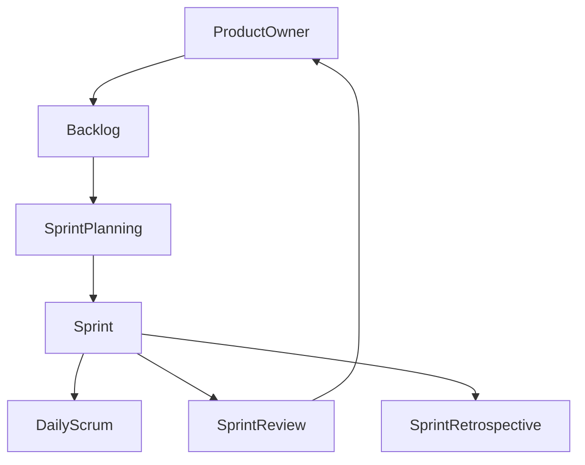

# 02. Gestión Ágil de Proyectos

## 🚀 Introducción a la Gestión Ágil

La gestión ágil permite adaptarse rápidamente a cambios y entregar valor de forma continua. Se basa en la colaboración, la iteración y la mejora constante.

### Historia y evolución

- **1990s**: Métodos iterativos (RAD, DSDM)
- **2001**: Manifiesto Ágil
- **2000s**: Scrum, Kanban, XP
- **Actualidad**: Escalado ágil (SAFe, LeSS), DevOps

## 🏗️ Principios y Prácticas Ágiles

- Entregas incrementales
- Feedback continuo
- Equipos auto-organizados
- Priorización basada en valor
- Transparencia y comunicación

## ⚡ Ejemplo: Ciclo Scrum

## 📝 Ejercicio Práctico

1. Define roles y artefactos de Scrum para un proyecto web.
2. Elabora un tablero Kanban para gestionar tareas de un sprint.

## 🎯 Buenas Prácticas

- Fomenta la comunicación abierta
- Revisa y adapta procesos en cada iteración
- Prioriza el valor entregado al cliente

---

**Siguiente**: [03. Git y Control de Versiones](./03-git.md)
