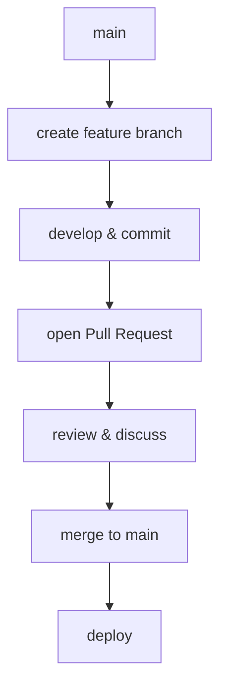
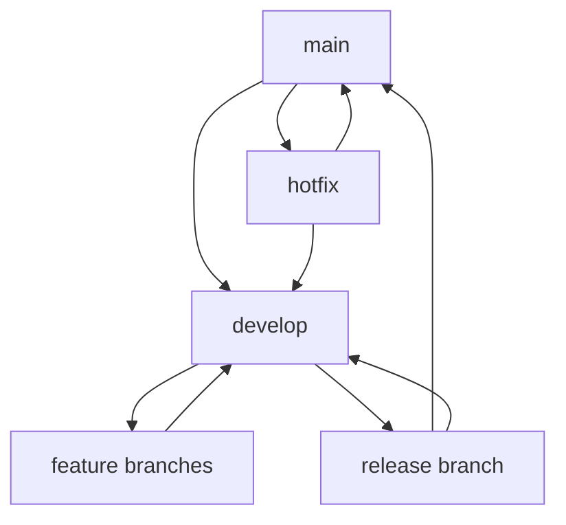

# 03. Ramas y Flujos de Trabajo

## 🌳 ¿Qué es una rama?
Una rama (branch) es una línea de desarrollo independiente que permite trabajar en nuevas funcionalidades, experimentos o correcciones sin afectar la rama principal (main/master). Es una de las características más poderosas de Git.

### Conceptos fundamentales
- **main/master**: Rama principal estable del proyecto
- **feature branch**: Rama para desarrollar una funcionalidad específica
- **hotfix**: Rama para correcciones urgentes
- **release**: Rama para preparar versiones

### Ventajas de usar ramas
- **Aislamiento**: Cada característica se desarrolla independientemente
- **Experimentación**: Prueba ideas sin riesgo
- **Colaboración**: Múltiples desarrolladores pueden trabajar simultáneamente
- **Historial limpio**: Organización clara de cambios por funcionalidad

## 🛠️ Comandos de Ramas

### Gestión básica de ramas
```bash
# Crear nueva rama
git branch nueva-funcionalidad

# Cambiar a una rama
git checkout nueva-funcionalidad

# Crear y cambiar en un solo comando
git checkout -b feature/login-usuario

# Alternativa moderna (Git 2.23+)
git switch -c feature/carrito-compras

# Listar todas las ramas
git branch

# Listar ramas remotas también
git branch -a

# Ver última actividad en cada rama
git branch -v
```

### Navegación entre ramas
```bash
# Cambiar a rama existente
git checkout main
git switch desarrollo  # Comando moderno

# Volver a la rama anterior
git checkout -
git switch -

# Ver en qué rama estás
git branch --show-current
```

### Eliminar ramas
```bash
# Eliminar rama local (fusionada)
git branch -d feature/completada

# Forzar eliminación (¡cuidado!)
git branch -D feature/experimental

# Eliminar rama remota
git push origin --delete feature/obsoleta
```

## 🔄 Fusión de Ramas (Merge)

### Tipos de merge
1. **Fast-forward**: No hay commits nuevos en la rama destino
2. **Three-way merge**: Ambas ramas tienen commits nuevos
3. **Squash merge**: Combina todos los commits en uno solo

### Fusión básica
```bash
# Cambiar a rama destino
git checkout main

# Fusionar rama feature
git merge feature/nueva-funcionalidad

# Ver historial después del merge
git log --graph --oneline
```

### Merge con opciones específicas
```bash
# Merge sin fast-forward (siempre crea commit de merge)
git merge --no-ff feature/importante

# Squash merge (combina commits)
git merge --squash feature/muchos-commits

# Merge con mensaje personalizado
git merge -m "Integra sistema de pagos" feature/pagos
```

## 🌊 Flujos de Trabajo Colaborativos

### 1. GitHub Flow (Recomendado para equipos pequeños)


**Pasos del GitHub Flow:**
1. Crear rama desde main actualizado
2. Desarrollar y hacer commits
3. Abrir Pull Request
4. Revisión de código y discusión
5. Merge a main
6. Deployment automático

### 2. Git Flow (Para proyectos con releases programados)


**Ramas en Git Flow:**
- **main**: Versión en producción
- **develop**: Integración de features
- **feature/**: Nuevas funcionalidades
- **release/**: Preparación de versiones
- **hotfix/**: Correcciones urgentes

### 3. Feature Branch Workflow
```bash
# Actualizar main
git checkout main
git pull origin main

# Crear feature branch
git checkout -b feature/user-authentication

# Trabajar y hacer commits
git add .
git commit -m "Add login form"
git commit -m "Implement password validation"

# Subir la rama
git push -u origin feature/user-authentication

# Crear Pull Request en GitHub
# Después del merge, limpiar
git checkout main
git pull origin main
git branch -d feature/user-authentication
```

## 🔀 Pull Requests y Revisiones de Código

### ¿Qué es un Pull Request?
Un Pull Request (PR) es una propuesta para fusionar cambios de una rama a otra. Permite:
- **Revisión de código**: Otros desarrolladores revisan antes del merge
- **Discusión**: Comentarios y sugerencias sobre los cambios
- **Testing**: Ejecutar pruebas automáticas antes del merge
- **Documentación**: Explicar qué y por qué se cambió

### Crear un Pull Request efectivo
```markdown
## Título del PR
Breve descripción de la funcionalidad (ej: "Implementa autenticación de usuarios")

## Descripción
### ¿Qué cambios incluye este PR?
- Agrega formulario de login
- Implementa validación de credenciales
- Integra con API de autenticación

### ¿Por qué son necesarios estos cambios?
Para permitir a los usuarios acceder a funcionalidades protegidas.

### ¿Cómo probar estos cambios?
1. Navegar a /login
2. Probar con credenciales válidas e inválidas
3. Verificar redirección después del login

### Screenshots (si aplica)
[Agregar imágenes del cambio visual]
```

### Mejores prácticas para PRs
- **Tamaño manageable**: PRs pequeños son más fáciles de revisar
- **Un objetivo**: Un PR, una funcionalidad
- **Tests incluidos**: Agrega pruebas para tu código
- **Descripción clara**: Explica el qué, por qué y cómo
- **Self-review**: Revisa tu propio código antes de enviarlo

### Revisión de código efectiva
```bash
# Revisar PR localmente
git fetch origin pull/123/head:pr-123
git checkout pr-123

# Probar los cambios
npm test
npm start

# Regresar a main después de la revisión
git checkout main
git branch -D pr-123
```

## 🚀 Comandos Avanzados de Ramas

### Rebase interactivo
```bash
# Limpiar historial de commits antes del PR
git rebase -i HEAD~3

# Opciones en rebase interactivo:
# pick = usar commit tal como está
# reword = cambiar mensaje del commit
# edit = pausar para editar commit
# squash = combinar con commit anterior
# drop = eliminar commit
```

### Cherry-pick
```bash
# Aplicar commit específico de otra rama
git cherry-pick abc1234

# Cherry-pick múltiples commits
git cherry-pick abc1234..def5678
```

### Stash para cambio rápido de rama
```bash
# Guardar cambios temporalmente
git stash

# Cambiar de rama
git checkout otra-rama

# Restaurar cambios guardados
git stash pop
```

## 🏋️ Ejercicios Prácticos

### Ejercicio 1: Feature Branch básico
1. Crea un repositorio nuevo con archivo README
2. Crea rama `feature/about-page`
3. Agrega archivo about.html con contenido
4. Haz commit y merge a main
5. Elimina la rama feature

### Ejercicio 2: Simulación de Pull Request
1. Crea rama `feature/contact-form`
2. Agrega formulario de contacto
3. Sube la rama a GitHub
4. Crea Pull Request
5. Haz comentarios como reviewer
6. Merge el PR

### Ejercicio 3: Git Flow básico
1. Inicializa repositorio con rama develop
2. Crea feature branch desde develop
3. Desarrolla funcionalidad
4. Merge feature a develop
5. Crea release branch
6. Merge release a main y develop

### Ejercicio 4: Conflictos y resolución
1. Crea dos ramas que modifiquen el mismo archivo
2. Intenta hacer merge
3. Resuelve conflictos manualmente
4. Completa el merge

## 🎯 Buenas Prácticas de Ramas

### Nomenclatura de ramas
```bash
# Usar prefijos descriptivos
feature/user-dashboard
bugfix/header-alignment  
hotfix/security-patch
release/v2.1.0
experiment/new-ui

# Usar kebab-case (guiones)
feature/shopping-cart-checkout
```

### Estrategias de merge
- **Merge commits**: Preserva historial completo (`--no-ff`)
- **Squash merge**: Historia limpia, un commit por feature
- **Rebase merge**: Historia lineal, sin merge commits

### Protección de ramas
En GitHub, configura:
- **Branch protection rules** para main
- **Required reviews** antes de merge
- **Status checks** (CI/CD) obligatorios
- **Up-to-date branch** requerido

### Limpieza regular
```bash
# Ver ramas ya fusionadas
git branch --merged

# Eliminar múltiples ramas fusionadas
git branch --merged | grep -v "main\|develop" | xargs git branch -d

# Limpiar referencias remotas obsoletas
git remote prune origin
```

## 🔧 Solución de Problemas Comunes

### "Your branch is behind/ahead"
```bash
git status
git pull origin main  # Si estás behind
git push origin main  # Si estás ahead
```

### Cambios no commitados al cambiar rama
```bash
git stash
git checkout otra-rama
git stash pop  # En la nueva rama si quieres los cambios allí
```

### Olvidaste en qué rama estás
```bash
git branch --show-current
git status
```

### Recuperar rama eliminada accidentalmente
```bash
git reflog  # Encontrar hash del último commit
git checkout -b rama-recuperada abc1234
```

---
**Anterior**: [02. Repositorios Remotos](./02-remotos.md) | **Siguiente**: [04. Resolución de Conflictos](./04-conflictos.md)