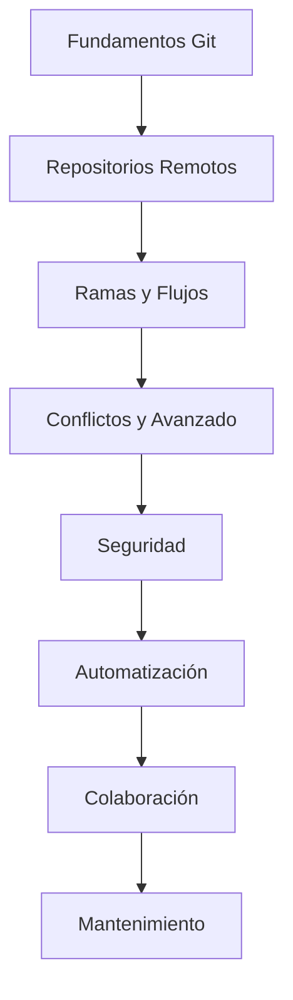

# ?? Git y GitHub: Control de Versiones y Colaboración Profesional

## ?? Información General

**Duración**: 6 semanas  
**Modalidad**: Práctica intensiva  
**Nivel**: Básico a Intermedio  
**Tecnologías**: Git, GitHub, GitHub Actions

> Un curso completo para dominar el control de versiones, la colaboración en proyectos y la automatización con Git y GitHub.

## ?? Objetivos del Curso

### Objetivo General
Aprender a gestionar proyectos de software de forma profesional usando Git y GitHub, desde el control de versiones básico hasta flujos colaborativos y automatización DevOps.

### Objetivos Específicos
- Dominar los comandos esenciales de Git
- Gestionar repositorios remotos y colaborativos en GitHub
- Trabajar con ramas, merges y resolución de conflictos
- Implementar buenas prácticas de seguridad y mantenimiento
- Automatizar flujos de trabajo con GitHub Actions
- Colaborar en proyectos open source y privados

## ?? Dirigido a

? Desarrolladores principiantes y junior  
? Programadores migrando a Git  
? Equipos de desarrollo colaborativo  
? Estudiantes de ingeniería y carreras afines

## ?? Estructura del Curso

### [01. Introducción a Git y GitHub](./01-introduccion.md)
- Historia y conceptos clave
- Instalación y configuración
- Primer repositorio y commit

### [02. Repositorios Remotos y GitHub](./02-remotos.md)
- Clonar, push, pull y fetch
- Configuración de remotos
- Forks y upstream

### [03. Ramas y Flujos de Trabajo](./03-ramas.md)
- Creación y gestión de ramas
- Flujos colaborativos (Git Flow, GitHub Flow)
- Pull requests y revisiones

### [04. Resolución de Conflictos y Comandos Avanzados](./04-conflictos.md)
- Identificación y resolución de conflictos
- Rebase, cherry-pick y revert
- Estrategias de merge

### [05. Seguridad y Buenas Prácticas](./05-seguridad.md)
- Llaves SSH y credenciales
- Protección de ramas
- Gestión de permisos y roles

### [06. Automatización y DevOps con GitHub Actions](./06-automatizacion.md)
- Workflows y pipelines CI/CD
- Ejecución de pruebas automáticas
- Despliegue continuo

### [07. Colaboración Avanzada y Gestión de Proyectos](./07-colaboracion.md)
- Issues, proyectos y discusiones
- Organización de equipos
- Gestión de tareas y milestones

### [08. Mantenimiento, Auditoría y Eficiencia](./08-mantenimiento.md)
- Limpieza de repositorios
- Auditoría de cambios
- Optimización y troubleshooting

## ??? Herramientas y Recursos
- **Git**: Control de versiones distribuido
- **GitHub**: Plataforma de colaboración y hosting
- **GitHub Desktop**: Cliente gráfico
- **Visual Studio Code**: Editor recomendado
- **GitHub Actions**: Automatización de flujos

## ?? Progresión del Aprendizaje



## ?? Configuración del Entorno

### Requisitos Mínimos
- **SO**: Windows, macOS, Linux
- **RAM**: 4GB
- **Espacio**: 2GB disponibles
- **Procesador**: Intel i3 o equivalente

### Instalación Rápida
```bash
# Instalar Git
# Windows
winget install --id Git.Git
# macOS
brew install git
# Linux
sudo apt-get install git

# Instalar GitHub Desktop (opcional)
winget install --id GitHub.GitHubDesktop

# Verificar instalación
git --version
```

## ?? Recursos Adicionales
- [Documentación Git](https://git-scm.com/doc)
- [GitHub Docs](https://docs.github.com/)
- [Pro Git Book](https://git-scm.com/book/es/v2)
- [GitHub Learning Lab](https://lab.github.com/)

## ?? Certificación y Evaluación

### Sistema de Evaluación
- Ejercicios prácticos: 40%
- Proyecto colaborativo: 40%
- Participación y buenas prácticas: 20%

### Certificados Relacionados
- GitHub Campus Expert
- GitHub Actions Hero

## ????? Instructor y Soporte
- Learning by doing: 70% práctica, 30% teoría
- Code reviews y mentoría
- Comunidad Discord y repositorio GitHub

---

## ?? ¡Comienza tu Journey!

¿Listo para dominar Git y GitHub?

?? [Empezar con Módulo 1: Introducción](./01-introduccion.md)

---

*"El mejor momento para aprender Git fue ayer. El segundo mejor momento es ahora."*

?? **Contacto**: Para dudas específicas del curso  
?? **Recursos**: [Repositorio del curso](.)
